# HealthVault AI — Medical Memory & Intelligence System

> **Pakistan's First AI-Powered Personal Health Operating System: Complete longitudinal medical history, Human-in-the-Loop prescription intelligence, web push adherence reminders, and zero-login ephemeral emergency triage.**

---

## 📖 Overview

**HealthVault AI** is a privacy-first, multi-agent clinical memory and intelligence platform tailored specifically for Pakistan's healthcare ecosystem. It bridges the critical divide between chaotic paper-based prescriptions, fragmented diagnostic lab slips, and emergency medical triage by providing:

1. **AI Medical Vault & Ingestion**: High-precision multimodal document parsing that deciphers South Asian handwritten prescriptions, mixed English/Urdu dosage directions (*"Sig: 1-0-1 کھانے کے بعد"*), and diagnostic lab reports with Human-in-the-Loop (HITL) review drafts.
2. **1-Page AI Doctor Visit Sheet**: Rapid clinical executive summary synthesized from full patient history, formatted for rapid physician consultation and print-ready single-page A4 distribution.
3. **Prescription Interpreter & Grounded RAG Chat**: Interactive conversational AI that clarifies complex medical jargon, Latin dosage notations (e.g., "BD", "TDS"), and drug usage in patient-friendly bilingual (English/Urdu) formats with strict pharmacopoeia grounding.
4. **Smart Medication Planner & Adherence Engine**: Dynamic daily dosage routines mapped to patient meal routines (Breakfast, Lunch, Dinner), interactive adherence dose logging, and automated silent web push reminders via VAPID / Service Worker.
5. **Zero-Login Ephemeral Emergency Triage**: Single-use or time-bound emergency QR access for paramedics with real-time GPS geolocation tracking, ICE (In Case of Emergency) contact alert routing, and strict anti-sharing URL safeguards.
6. **Longitudinal Lab Biomarker Tracking**: Interactive timeline trajectories for HbA1c, fasting glucose, lipid profiles, and renal parameters with clinical normal reference ranges.

---

## 🛠️ Technology Stack

| Layer | Technologies & Frameworks |
|---|---|
| **Backend API** | FastAPI, Python 3.13 / 3.10+, Uvicorn (ASGI), Pydantic v2, Pydantic-Settings |
| **Database & ORM** | PostgreSQL, SQLAlchemy 2.0 (AsyncIO), AsyncPG |
| **Cloud Storage & Security** | Supabase Private Storage (HMAC-SHA256 Signed URLs, 1800s TTL), Alibaba Cloud OSS |
| **AI / Multi-Agent Orchestration** | LangGraph 1.2+ (`StateGraph`), LangChain (LCEL), Alibaba Cloud DashScope (Qwen-Plus), Google AI Studio (Gemini 3.1 Flash Lite / 2.0 Flash) |
| **OCR & Vision** | PaddleOCR (Local CPU/GPU), Pluggable Vision Engine (Gemini Flash, Qwen-VL, GPT-4o) |
| **Real-Time & Notifications** | Web Push API (VAPID / PyWebPush), Service Worker (`sw.js`), Server-Sent Events (SSE / `ntfy.sh`) |
| **Frontend Web App** | Next.js 14 (App Router), React 18, TypeScript, Tailwind CSS, Lucide React, Sonner |
| **Data Viz & Utilities** | Recharts, `qrcode.react`, Leaflet / GeoLocation API |
| **Design System** | Vault Teal (`#0D5C4A`), Active Emerald (`#0A8C6A`), Stone White (`#F5F8F7`), Emergency Crimson (`#C0392B`) |

---

## 📂 Project Directory Structure

```text
HealthVault_AI/
├── .qoder/                         # Architecture guidelines, API contracts & prompt specs
├── backend/                        # FastAPI Backend Application
│   ├── app/
│   │   ├── agents/                 # LangGraph workflows & multi-agent pipelines
│   │   │   ├── graphs/             # Compiled StateGraphs (Extraction, Interaction, RAG, Doctor Summary)
│   │   │   ├── nodes/              # Isolated deterministic node functions (OCR, validation, safety, map-reduce)
│   │   │   ├── state.py            # Typed state schemas (ExtractionState, InteractionState, InterpreterState, SummaryState)
│   │   │   ├── interaction_agent.py # Pharmacology guard agent bridge
│   │   │   ├── interpreter_agent.py # Prescription RAG agent bridge
│   │   │   ├── summary_agent.py    # 1-Page clinical briefing agent bridge
│   │   │   └── vault_graph.py      # Multimodal vault extraction pipeline
│   │   ├── api/                    # REST API routers & dependency injection
│   │   │   ├── v1/
│   │   │   │   ├── auth.py
│   │   │   │   ├── vault.py
│   │   │   │   ├── interpreter.py
│   │   │   │   ├── summary.py
│   │   │   │   ├── medications.py
│   │   │   │   ├── emergency.py
│   │   │   │   ├── interactions.py
│   │   │   │   ├── biomarkers.py
│   │   │   │   ├── notifications.py
│   │   │   │   └── user.py
│   │   │   ├── deps.py
│   │   │   └── router.py
│   │   ├── core/                   # App configuration, security, DB & mock data
│   │   │   ├── config.py
│   │   │   ├── database.py
│   │   │   ├── security.py
│   │   │   └── mock_data.py
│   │   ├── models/                 # SQLAlchemy ORM database models
│   │   │   ├── user.py
│   │   │   ├── record.py
│   │   │   ├── emergency_contact.py
│   │   │   ├── emergency_scan.py
│   │   │   ├── emergency_session.py
│   │   │   ├── notification.py
│   │   │   └── privacy.py
│   │   ├── schemas/                # Pydantic request & response schemas
│   │   ├── services/               # Core business logic services
│   │   │   ├── biomarker_service.py
│   │   │   ├── emergency_service.py
│   │   │   ├── llm_provider.py
│   │   │   ├── medication_service.py
│   │   │   ├── medicine_planner.py
│   │   │   ├── persistence_service.py
│   │   │   ├── privacy_service.py
│   │   │   └── vision_provider.py
│   │   └── main.py                 # FastAPI application entrypoint & Lifespan Scheduler
│   ├── scripts/                    # Database migrations & realistic seed scripts
│   ├── tests/                      # Pytest unit & integration test suite (139 passing tests)
│   ├── .env.example                # Backend environment configuration template
│   ├── pytest.ini                  # Pytest runner configuration
│   └── requirements.txt            # Python package dependencies
├── docs/                           # Architectural specs & feature catalogs
│   └── SYSTEM_FEATURES_AND_CAPABILITIES.md
├── frontend/                       # Next.js 14 Web Application
│   ├── public/                     # Icons, sound alerts, sw.js service worker
│   ├── src/
│   │   ├── app/                    # Next.js App Router (Marketing, Auth & Dashboard)
│   │   │   ├── (auth)/             # Login & Registration pages
│   │   │   ├── (dashboard)/        # Medical Vault, Summary, Planner, Biomarkers, Emergency, Activity
│   │   │   ├── emergency/          # Token-gated zero-login triage view & audit logger
│   │   │   ├── globals.css         # Tailwind directives, animations & print styles
│   │   │   ├── layout.tsx          # Root layout with providers & notification listeners
│   │   │   └── page.tsx            # High-conversion landing page
│   │   ├── components/             # Reusable UI widgets & feature components
│   │   │   ├── emergency/          # Triage monitors, QR cards, scan history & alerts
│   │   │   ├── interpreter/        # OCR viewer & prescription chat modal
│   │   │   ├── layout/             # Sidebar, Navbar & Notification bell
│   │   │   ├── planner/            # Daily dosage schedule & meal routine modal
│   │   │   ├── settings/           # Privacy controls & ICE routing configurations
│   │   │   ├── summary/            # Clinical briefing & Doctor visit print sheet
│   │   │   └── vault/              # Live scanner, file dropzone & record tables
│   │   ├── hooks/                  # Geolocation tracker, emergency listeners & Web Push
│   │   ├── locales/                # English & Urdu translation dictionaries
│   │   ├── services/               # Axios API client & typed backend SDK
│   │   └── types/                  # TypeScript interface contracts
│   ├── .env.example                # Frontend environment configuration template
│   ├── package.json
│   └── tailwind.config.js
└── README.md                       # Main project documentation
```

---

## 🧠 Multi-Agent Architecture (LangGraph & LangChain LCEL)

HealthVault AI employs a modular multi-agent graph architecture built on **LangGraph 1.2+ (`StateGraph`)** and **LangChain (LCEL)**, replacing linear procedural execution with typed, resilient, and checkpointed clinical workflows:

```mermaid
graph TD
    subgraph Workflow_A [Workflow A: Document Extraction Pipeline]
        A1[Multimodal Image / PDF] --> A2[node_ocr_extract: Vision LLM / CLAHE Preprocessor]
        A2 --> A3[node_entity_parse: Pydantic Schema Parsing]
        A3 --> A4[node_safety_audit: Pakistani Pharmacopoeia Bounds Check]
        A4 --> A5{node_human_review_pause: HITL Approval Gate}
        A5 -->|Confirmed| A6[node_db_commit: PostgreSQL Storage & Hydration]
        A5 -->|Draft Pause| A7[Draft Review Response]
    end

    subgraph Workflow_B [Workflow B: Drug Interaction & Allergy Guard]
        B1[Proposed Medications] --> B2[node_allergy_crosscheck: Rule-Based Allergen Matching]
        B2 -->|Critical Allergy Hit| B3[emergency_allergy_alert: High-Risk Flag]
        B2 -->|Standard| B4[node_pairwise_drug_check: Parallel Drug-Drug Pairs]
        B3 --> B4
        B4 --> B5[node_severity_aggregator: Clinical Risk & Bilingual Alerts]
    end

    subgraph Workflow_C [Workflow C: Grounded Prescription Interpreter]
        C1[Patient Chat / Question] --> C2[node_context_retriever: Structured Prescription Index]
        C2 --> C3{node_guardrail_check: Anti-Hallucination Gate}
        C3 -->|Out-of-Scope Diagnosis| C4[Clinical Refusal & Doctor Referral]
        C3 -->|Valid Grounded Query| C5[node_grounded_response_gen: Bilingual Nastaliq Urdu / EN Explainer]
    end

    subgraph Workflow_D [Workflow D: 1-Page AI Doctor Clinical Summary]
        D1[Patient History & Vault] --> D2[Map Worker 1: node_summarize_visits]
        D1 --> D3[Map Worker 2: node_summarize_chronic]
        D1 --> D4[Map Worker 3: node_summarize_lab_trends]
        D2 & D3 & D4 --> D5[Reducer: node_compile_clinical_brief]
        D5 --> D6[10-Second Physician Brief / A4 Visit Sheet]
    end
```



### 1. Workflow A: Document Extraction Pipeline (`DocumentExtractionGraph`)
* **`node_ocr_extract`**: Multimodal clinical document analysis via Gemini / Qwen-VL with unsharp mask, deskew, and CLAHE contrast enhancement.
* **`node_entity_parse`**: Extraction into standardized Pydantic entities (`ExtractedEntities`).
* **`node_safety_audit`**: Pakistani Pharmacopoeia validation (Levenshtein brand correction, fractional dosage preservation e.g. `0.5 tablet` / `آدھی گولی`, sig notation `1+0+1`).
* **`node_human_review_pause`**: LangGraph state checkpoint awaiting patient or clinician verification before database commit.
* **`node_db_commit`**: Commits verified records with duplicate checking and clinical entity hydration.

### 2. Workflow B: Drug Interaction & Allergy Guard (`InteractionEvaluationGraph`)
* **`node_allergy_crosscheck`**: Immediate deterministic rule check cross-referencing candidate drugs against patient documented allergies.
* **`node_pairwise_drug_check`**: Parallel/fan-out evaluation of candidate medications against the patient's active regimen.
* **`node_severity_aggregator`**: Synthesizes conflict severities (`critical`, `moderate`, `safe`), computes overall risk level, and generates bilingual recommendations with medical disclaimers.

### 3. Workflow C: Grounded Prescription RAG & Patient Explainer (`InterpreterGraph`)
* **`node_context_retriever`**: Grounded document context builder that indexes prescription items (medications, timings, food relations, diagnoses).
* **`node_guardrail_check`**: Anti-hallucination guardrail that strictly refuses non-prescription medical diagnoses and directs patients to in-person care.
* **`node_grounded_response_gen`**: Generates patient-friendly explanations in English and polished Nastaliq Urdu with timing schedules and audio scripts.

### 4. Workflow D: 1-Page AI Doctor Clinical Summary (`DoctorSummaryGraph`)
* **Map-Reduce Pattern**:
  * **Map Phase**: Parallel workers evaluating past encounters (`node_summarize_visits`), chronic diagnoses/medications (`node_summarize_chronic`), and biomarker trajectories (`node_summarize_lab_trends`).
  * **Reduce Phase**: Synthesis worker (`node_compile_clinical_brief`) generating a 10-second physician briefing.

---

## 🔌 API Endpoints Catalog (`/api/v1`)

### 1. Authentication & Identity (`/api/v1/auth`)
* `POST /api/v1/auth/register` — Register a new patient and issue deterministic Health ID (`HV-PAK-XXXXX`).
* `POST /api/v1/auth/login` — Authenticate credentials and return signed JWT access token.
* `GET /api/v1/auth/me` — Retrieve current authenticated session user profile.

### 2. Medical Vault & Ingestion (`/api/v1/vault`)
* `POST /api/v1/vault/upload` — Direct upload for PDF, JPG, and PNG clinical slips.
* `POST /api/v1/vault/upload-and-extract` — Full ingestion pipeline (Vision OCR + LangGraph entity extraction + DB persistence).
* `GET /api/v1/vault/records/{user_id}` — Chronological medical records repository.
* `DELETE /api/v1/vault/records/{record_id}` — Secure record deletion with cascading cleanup.

### 3. Prescription Interpreter & Grounded Chat (`/api/v1/interpreter`)
* `POST /api/v1/interpreter/extract` — Decipher handwriting and extract structured medications, dosages, and frequency instructions.
* `POST /api/v1/interpreter/chat` — Conversational assistant to clarify dosage schedules and Urdu instructions strictly grounded in the document.

### 4. AI Clinical Summary (`/api/v1/summary`)
* `GET /api/v1/summary/generate` — Generate 1-page clinical executive summary with patient vitals, active regimens, abnormal lab alerts, and doctor discussion points.

### 5. Medication Planner & Adherence (`/api/v1/medications` & `/api/v1/interactions`)
* `GET /api/v1/medications/schedule` — Retrieve daily medication schedule matrix mapped to morning, afternoon, evening, and bedtime slots.
* `POST /api/v1/medications/log-dose` — Record adherence status for planned doses.
* `POST /api/v1/medications/manual` — Add or manage custom OTC medications.
* `POST /api/v1/interactions/check` — Real-time cross-checking of new medications against active prescriptions and lethal drug allergies.

### 6. Zero-Login Ephemeral Emergency Triage (`/api/v1/emergency`)
* `GET /api/v1/emergency/{health_id}?token=...` — Zero-login emergency access for first responders with token validation and patient privacy masking.
* `GET /api/v1/emergency/session/{token}` — Validate and access ephemeral, time-limited emergency triage sessions with anti-sharing URL guards.
* `POST /api/v1/emergency/log-scan` — Record paramedic scan events with GPS coordinates, reverse geocoding, and immediate ICE push notifications.
* `GET /api/v1/emergency/activity-logs` — Patient audit trail of all emergency access scans and geographic locations.
* `GET /api/v1/emergency/shared-alert-streams` — Live real-time emergency alert streams for linked caregivers.

### 7. In-App & Web Push Notifications (`/api/v1/notifications`)
* `GET /api/v1/notifications` — Fetch user notifications with read status and category filters.
* `PATCH /api/v1/notifications/{id}/read` — Mark notification as acknowledged.
* `POST /api/v1/notifications/push-subscription` — Register browser Web Push VAPID endpoint for automated background reminders.
* `POST /api/v1/notifications/test-push` — Trigger diagnostic test alert to confirm browser notification delivery.

### 8. User Profile & Privacy Controls (`/api/v1/user`)
* `GET /api/v1/user/profile` — Fetch patient demographics and emergency contact directory.
* `GET /api/v1/user/qr-code` — Retrieve active emergency QR metadata and access tokens.
* `POST /api/v1/user/regenerate-qr` — Instant key rotation for emergency access tokens.
* `PATCH /api/v1/user/emergency-toggle` — Instant master digital kill-switch for emergency QR access.
* `PATCH /api/v1/user/privacy-settings` — Granular toggles for blood group, allergies, medications, and clinical notes visibility.
* `POST /api/v1/user/ice-settings` — Configure ICE contact alerting, SMS dispatch, and push notification routing.

### 9. Longitudinal Biomarkers (`/api/v1/biomarkers`)
* `GET /api/v1/biomarkers/timeline` — Retrieve longitudinal lab test historical series (HbA1c, Fasting Glucose, Cholesterol, Creatinine).

---

## 🚀 Quickstart & Developer Setup

### Prerequisites
- **Node.js**: `v18.0.0` or higher
- **Python**: `v3.10` to `v3.13`
- **PostgreSQL**: `v14.0` or higher (or run in standalone mode via `USE_MOCK=True`)
- **API Keys** (Optional for live LLM mode): See [`backend/.env.example`](file:///d:/HealthVault_AI/backend/.env.example)

---

### 1. Backend Service Setup (FastAPI)

```bash
# 1. Navigate to backend directory
cd backend

# 2. Create and activate a Python virtual environment
python -m venv .venv

# Windows:
.\.venv\Scripts\activate
# macOS/Linux:
source .venv/bin/activate

# 3. Install backend dependencies
pip install -r requirements.txt

# 4. Configure environment variables
cp .env.example .env
# Edit .env with your database URL and API keys

# 5. Run database migrations or seed clinical test data
python scripts/seed_ali_raza.py

# 6. Launch FastAPI server
uvicorn app.main:app --reload --port 8000
```

* Backend API: **`http://localhost:8000`**
* Interactive Swagger Docs: **`http://localhost:8000/docs`**

---

### 2. Frontend Application Setup (Next.js 14)

```bash
# 1. Navigate to frontend directory
cd frontend

# 2. Install Node dependencies
npm install

# 3. Configure environment variables
cp .env.example .env.local

# 4. Start Next.js development server
npm run dev
```

* Frontend Web App: **`http://localhost:3000`**

---

## 🧪 Testing & Verification

Ensure full system integrity across both backend and frontend layers:

```bash
# 1. Run Complete Backend Pytest Suite (160 passing test cases across all units & graphs)
cd backend
pytest -v

# 2. Run LangGraph Multi-Agent Workflows Specifically
pytest -v tests/test_agents.py

# 3. Verify Frontend TypeScript Compilation
cd ../frontend
npx tsc --noEmit

# 4. Verify Production Bundle Build
npm run build
```

---

## 🔒 Security & Privacy Architecture

- **Private Storage with Signed URLs**: Patient prescription scans, lab reports, and radiology images are stored in a non-public Supabase Storage bucket. Access is strictly gated behind time-limited HMAC-SHA256 signed URLs (1800-second TTL), preventing direct bucket crawling or unauthenticated downloads.
- **Token-Gated QR Protection**: Emergency cards contain cryptographic tokens; scans do not expose full patient records or PII unless explicitly permitted by the patient's privacy settings.
- **Single-Use Ephemeral Triage**: Anti-sharing URL guards invalidate copied links to prevent unauthorized bystander access.
- **Granular Consent Toggles**: Patients can mask blood group, specific drug allergies, active regimens, or emergency notes at any time from their settings dashboard.
- **Real-Time ICE Notification Routing**: Instant dispatch of GPS location and scanner IP to designated emergency contacts upon QR scan.
- **Zero-Login First Responder View**: Clean, high-contrast mobile triage layout accessible on any modern mobile browser without credentials.